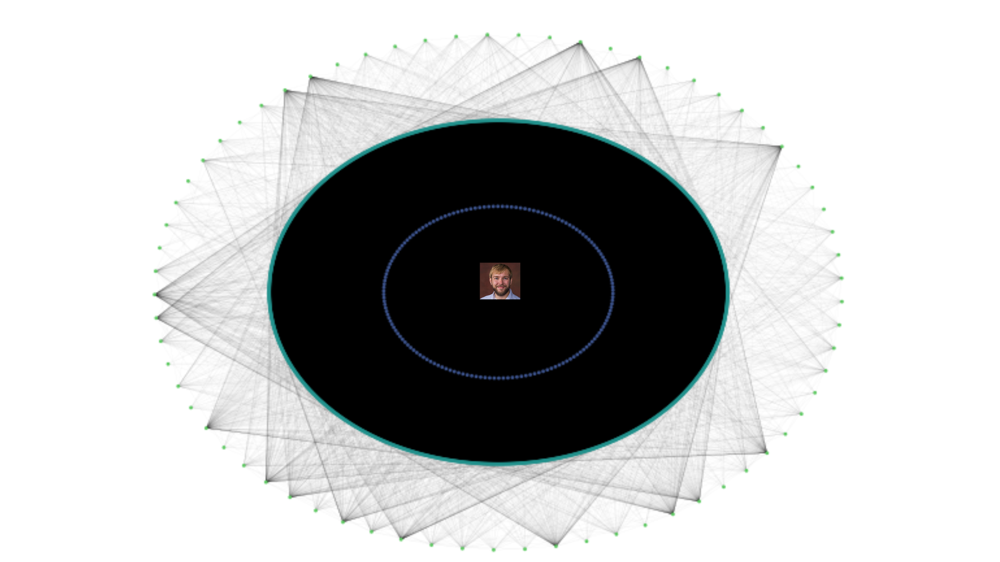

# Dusty score



Code and results for the Fall 2022 MATH 22A final project on the Academic Connectivity of Harvard Students by Sirui Cai and Je Qin Chooi. The paper is available in the repository above as `Academic-Connectivity-of-Harvard-Students.pdf`.

## Description

We used linear algebra to describe graph algorithms that help us determine the Dusty score of all Harvard first-years in Fall 2022. The Dusty score measures a student’s degree of separation from Dusty based on shared class connections. For example, a student who is directly taught by Dusty has a Dusty score of 1, while a student who is not taught by Dusty but is in the same class as someone who is will have a Dusty score of 2

## Getting Started

We used pandas (general data read/write and manipulation), numpy (matrix manipulation), networkx (graph algorithms and visualization), beautifulsoup (parsing HTML) and requests (web scraping)
### Dependencies
```
pip install -r requirements.txt
```

### Executing program

You do not need to run the programs below to get the results. A set of results can be found in the folder `final_results`

Before executing, remember to install the dependencies through the command above.

1. Run `scrape-q-report-links.py` to get the Q Report links.
2. Run `download-q-reports.py` to get the class sizes in Fall 2021.
3. Run `generate_random_students.py`. Change the number of students as desired.
4. Run `generate_membership_matrix.py`.
5. Run `apsp.py`.
6. Run `visualization.py`
7. Now we proceed with real data. Run `process_fas_data.py`.
8. Repeat steps 3 to 6, but change the file names and other related variables.


## License

This project is licensed under the MIT License - see the `LICENSE.md` file for details.